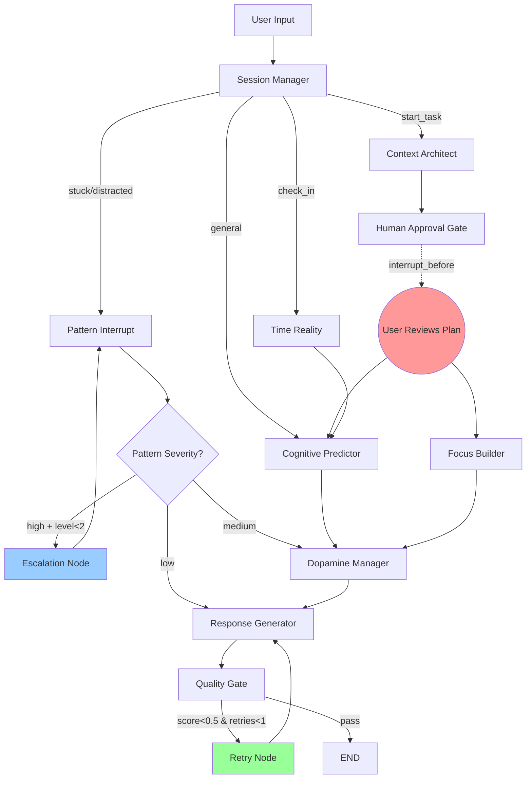
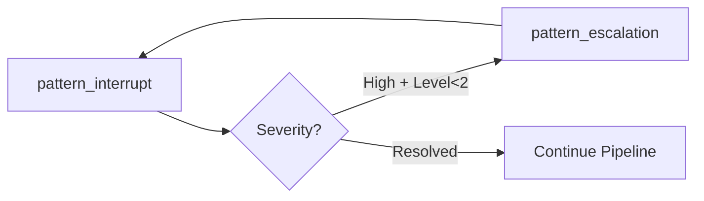
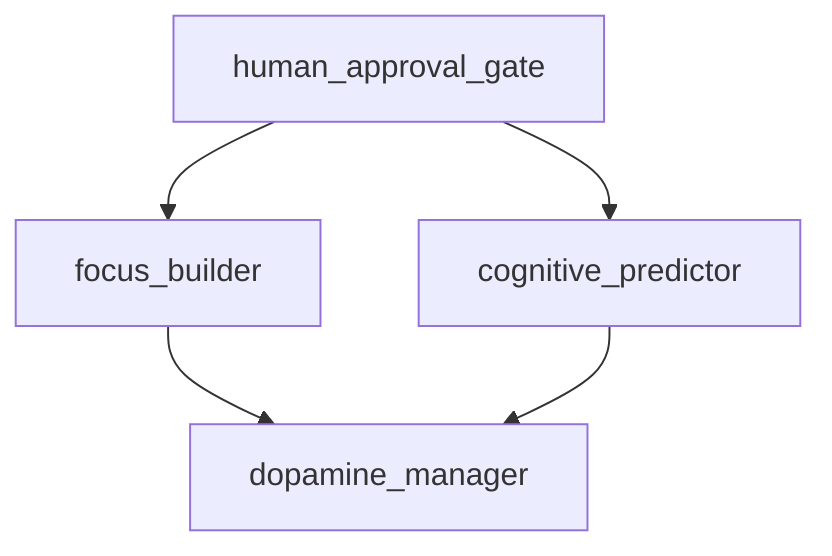

# 🧠 NeuroFlow: AI-Powered ADHD Cognitive Support System

> **"I built a prosthetic prefrontal cortex because my actual one kept ghosting me."**

<div align="center">

[](https://www.python.org/downloads/)
[](https://github.com/langchain-ai/langgraph)
[](https://ai.google.dev/)
[](https://streamlit.io)

**A neuroscience-informed, multi-agent AI system that replaces willpower with intelligent workflow automation**

[Features](#-core-features) • [Architecture](#-architecture-the-langgraph-advantage) • [My Story](#-my-adhd-journey) • [Installation](#-installation) • [Agents](#-the-7-agent-squad)

</div>

---

## 📖 Table of Contents

- [My ADHD Journey](#-my-adhd-journey)
- [The Problem: Executive Dysfunction](#-the-problem-executive-dysfunction)
- [The Solution: External Executive Function](#-the-solution-external-executive-function)
- [Architecture: The LangGraph Advantage](#-architecture-the-langgraph-advantage)
- [Core Features](#-core-features)
- [The 7-Agent Squad](#-the-7-agent-squad)
- [Advanced Graph Patterns](#-advanced-graph-patterns-what-makes-this-special)
- [Tech Stack](#-tech-stack)
- [Installation](#-installation)
- [Real Usage Scenario](#-real-usage-scenario)
- [Measurable Outcomes](#-measurable-outcomes)
- [Project Structure](#-project-structure)
- [Future Roadmap](#-future-roadmap)

---

## 🎯 My ADHD Journey

### The Wall Nobody Sees

I've lived with ADHD my entire life, but I was only diagnosed at 2024. Before that, I thought I was just "lazy," "unfocused," or "not trying hard enough." The most frustrating part? **I knew exactly what I needed to do. I just... couldn't start.**

People don't understand that ADHD isn't about intelligence or motivation. It's **neurological**. My brain literally produces 30-40% less dopamine in key circuits. This isn't metaphorical — it's measurable on fMRI scans.

### The Daily Struggles

**Time Blindness**  
I'd think "I have all day," and then it's 5 PM and I've done nothing except scroll through Reddit 47 times. Time doesn't *feel* real until it's too late.

**The Wall of Awful**  
Simple tasks feel like climbing Mount Everest. There's an invisible emotional wall between me and starting. Even replying to a text can take 3 days because my brain screams "THIS IS HARD" even though I know it's not.

**Doom Loops**  
Get distracted → Feel guilty → Seek comfort (more scrolling) → More guilt → Paralysis. Rinse, repeat. By the end of the day, I've done nothing but feel terrible about myself.

**Working Memory Leaks**  
I'll start a task, get interrupted, and completely forget what I was doing. It's like having 47 browser tabs open but only being able to see one at a time, and they keep closing randomly.

### The Breaking Point

After years of failed productivity systems (bullet journals, Pomodoro apps, "just discipline yourself" advice), I realized something:

> **Standard productivity tools assume you have a neurotypical executive function. I don't.**

I needed something that understood my brain's wiring, not fought against it. Something that didn't say "just do it," but instead asked "what's blocking you, and how can we engineer around that?"

That's why I built **NeuroFlow**.

---

## 🧱 The Problem: Executive Dysfunction

ADHD isn't "can't focus." It's **Executive Dysfunction** — the brain's CEO is on permanent vacation.

### What Breaks:

| Function | Neurotypical Brain | ADHD Brain |
|----------|-------------------|------------|
| **Task Initiation** | "I should start" → starts | "I should start" → 3 hours of dread → still hasn't started |
| **Time Perception** | Accurate sense of time passing | Time is either "now" or "not now" |
| **Working Memory** | Holds 7±2 items | Holds 3 items on a good day |
| **Emotional Regulation** | Frustration → keep going | Frustration → complete shutdown |
| **Dopamine Regulation** | Steady baseline | Chronically deficient → seeks constant novelty |

### The Neuroscience:

- **Prefrontal Cortex**: Underdeveloped connections → poor planning, impulse control
- **Striatum**: Low dopamine → tasks feel unrewarding unless they're intensely stimulating
- **Default Mode Network**: Overactive → constant mind-wandering
- **Anterior Cingulate Cortex**: Inefficient → can't switch tasks easily

**NeuroFlow is designed to act as an external prefrontal cortex**, compensating for these deficits through AI-driven structure.

---

## 💡 The Solution: External Executive Function

Instead of fighting my brain, I built a system that **works with it**.

### Core Philosophy

1. **Dopamine First**: Tasks aren't done because they're "important" — they're done because they're **stimulating**. NeuroFlow gamifies everything.

2. **Environment > Willpower**: Don't force focus — **engineer** an environment where focus is the default state.

3. **Compassionate Accountability**: No shame. If I get distracted, the system gently pivots me back without judgment.

4. **Externalize Everything**: My brain can't hold context? Fine. The system holds it for me.

### Why Traditional Tools Fail for ADHD

| Tool | Why It Fails |
|------|--------------|
| **To-Do Lists** | Overwhelm. Seeing 40 items triggers paralysis, not action |
| **Pomodoro Timers** | Assumes you can start. We can't even press "start" |
| **Habit Trackers** | ADHD brains are dopamine-deficient — delayed rewards don't work |
| **Notion/Obsidian** | Requires organization skills we don't have. We spend hours organizing instead of doing |
| **Accountability Partners** | We feel shame, not motivation. Plus, we mask heavily |

### What NeuroFlow Does Differently

- **Breaks tasks into 2-minute micro-steps** (bypasses initiation paralysis)
- **BPM-mapped playlists** (audio entrainment for focus states)
- **Variable-ratio rewards** (slot machine psychology for dopamine hits)
- **AI body doubling** (reduces isolation without human judgment)
- **Pattern interrupts** (catches doom loops before they spiral)
- **Time reality checks** (compensates for time blindness)

---

## 🏗️ Architecture: The LangGraph Advantage

### Why LangGraph?

Most AI systems are **stateless chatbots** — they respond to a message and forget. ADHD support requires **stateful, multi-turn cognitive workflows** with:

- **Cyclic logic** (intervention escalation loops)
- **Conditional routing** (different paths based on cognitive state)
- **Parallel execution** (multiple agents running concurrently)
- **Human-in-the-loop** (approval gates for complex plans)
- **Self-correction** (quality gates that retry bad outputs)

**LangGraph** is a framework for building stateful, multi-actor applications as **graphs**, not linear chains. It's perfect for simulating the kind of complex, adaptive thinking an external executive function needs.

### The Graph Structure



### State Management

NeuroFlow maintains a **complex state object** across all agents:

```python
class NeuroFlowState(TypedDict):
    # Session tracking
    session_id: str
    session_start: str
    interaction_count: int
    messages: Annotated[list, add_messages]
    
    # User context
    user_input: str
    intent: str  # start_task | stuck | distracted | check_in
    priority: bool
    
    # Cognitive modeling (75+ variables)
    cognitive_state: dict  # focus, energy, dopamine, crash prediction
    interaction_metrics: dict  # typing speed, message length, response time
    pattern_detection: dict  # current pattern, interventions attempted
    dopamine_economy: dict  # daily balance, transactions, rewards
    
    # Active task
    current_task: dict  # task info, environment, progress, milestones
    
    # Agent outputs (collected before synthesis)
    cognitive_output: str
    context_output: str
    pattern_output: str
    time_output: str
    focus_output: str
    dopamine_output: str
    
    # Advanced graph control
    pattern_escalation_level: int  # 0-2 (cyclic loop counter)
    response_retry_count: int      # self-correction counter
    quality_score: float           # 0.0-1.0
    needs_human_approval: bool     # HITL flag
    
    # Final response
    response: str
```

This isn't just data storage — it's a **cognitive model** that evolves across the conversation.

---

## 🎨 Core Features

### 1. 🎧 Focus Studio (The "Initiation Button")

**Problem**: The hardest part of ADHD is starting. The "Wall of Awful" makes even simple tasks feel impossible.

**Solution**: Instant task decomposition + custom work environment.

**How it works**:
1. User describes task: *"Write a 2000-word essay on climate change"*
2. Context Architect agent analyzes cognitive load
3. Breaks into **5-10 micro-steps** (each <5 min)
4. Generates **BPM-mapped playlist** based on preferred genre:
   - 🚀 **Startup** (130-150 BPM): High energy to overcome inertia
   - 🎯 **Deep Focus** (70-90 BPM): Calm for sustained attention
   - 💪 **Grind Phase** (140+ BPM): Energy boost for boring middle sections
   - 🧘 **Wind Down** (60-80 BPM): Slow for wrapping up
5. Creates gamification layer (if task is repetitive)
6. Configures focus environment (music, timer, body double, break activities)

**Example Output**:
```
📋 Task: Write climate change essay
Cognitive Load: HIGH | Estimated: 45 min → Realistic: 68 min (ADHD buffer)

🏁 Initiation Ritual:
1. Close all browser tabs except Google Docs
2. Put on headphones
3. Get cold water on desk
4. Phone in drawer, face down
5. Open Doc → EXACT section (not "the document")
6. Write "DRAFT" at top (permission to be imperfect)
7. Set timer: 15 minutes
8. Write ONE terrible sentence on purpose

📝 Micro-Steps:
1. Open Doc and write title (2 min) → ✅ Ready!
2. Bullet-point 3 main arguments (5 min) → ⭐ Rolling!
3. Write intro paragraph - no editing (10 min) → 🔥 Momentum!
4. Write body paragraph 1 (15 min) → 💪 Crushing it!
5. Review and one quick edit pass (8 min) → 🏆 Done!

🎶 Your K-Pop Focus Playlist (BPM-Mapped):
• 🚀 Startup: "Kill This Love" - Blackpink (140 BPM) - High energy activation
• 🎯 Deep Focus: "Spring Day" - BTS (75 BPM) - Calm concentration
• 💪 Grind Phase: "God's Menu" - Stray Kids (150 BPM) - Fight the slump
• 🧘 Wind Down: "Palette" - IU (70 BPM) - Reflective wrap-up

💃 Break Activities:
- Dance to one K-pop song (literally move your body)
- 10 jumping jacks or walk to another room
- Drink water while looking outside
```

### 2. 🤖 "Alex" — AI Body Double

**Problem**: ADHD makes you feel isolated. Working alone = instant distraction.

**Solution**: Virtual co-worker who's always there, never judges.

**How it works**:
- Persistent presence in sidebar during Focus Mode
- Celebrates **every single micro-step** completed
- Gently redirects distractions without shame
- Auto-congratulates on Pomodoro completion
- Tracks session streaks and rewards

**Example Interaction**:
```
You: [checks step 1: "Open Doc"]
Alex: ✅ First step DONE! That's the hardest one — you beat the 
      initiation barrier! 💪 4 more to go, you've got this!

You: I just remembered I need to text my friend about Friday
Alex: Great! I'll park that thought for later. Let's finish 
      this paragraph first — you're only 3 minutes in!

You: [25-minute timer ends]
Alex: 🎉 YES! Session #1 CRUSHED! ⭐ Reward earned. Take your 
      5-minute break — you absolutely deserve it!
```

### 3. 🧠 Pattern Detective (The "Anti-Self-Sabotage" Agent)

**Problem**: ADHD brains fall into predictable loops (doom scrolling, productive procrastination) without realizing it.

**Solution**: Real-time behavioral pattern detection with **escalating interventions**.

**Detectable Patterns**:
- **Avoidance Spiral**: Planning multiple tasks but starting none
- **Productive Procrastination**: Doing legitimate but low-priority tasks
- **Distraction Cascade**: Rapid topic switching
- **Decision Paralysis**: Analysis paralysis from too many options
- **Perfectionism Loop**: Rewriting completed work endlessly

**Escalation Strategy** (Cyclic Graph Logic):
```python
# Level 0: Gentle observation
"I notice you've been researching for 40 minutes. How's it going?"

# Level 1: Direct naming + action
"This looks like an avoidance spiral. Your brain is overwhelmed. 
Let's shrink it: Just write ONE sentence. Any sentence."

# Level 2: Decisive intervention (graph loops back if needed)
"You've been researching for 90 minutes. STOP. Close all tabs except 
one. Write for 10 minutes. Timer starting NOW. 🚀"
```

**How the cycle works** (LangGraph):
```python
def _route_pattern_severity(state):
    confidence = state["pattern_detection"]["confidence"]
    level = state["pattern_escalation_level"]
    
    if confidence > 0.7 and level < 2:
        return "escalate"  # → LOOP BACK to pattern_interrupt
    elif confidence > 0.3:
        return "full_analysis"  # → proceed to cognitive analysis
    else:
        return "quick_response"  # → low severity, direct response
```

### 4. 🍬 Dopamine Economy

**Problem**: ADHD brains are dopamine-deficient. Motivation is a depletable resource, not willpower.

**Solution**: Track mental fuel as a daily budget (0-100).

**Transaction Scoring**:
| Event | Points | Why |
|-------|--------|-----|
| Task Started | +15 | Hardest action (initiation = peak dopamine cost) |
| Task Completed | +10 | Reward for closure |
| Took Break Before Crash | +8 | Self-care = future fuel |
| Pattern Interrupted | +12 | Breaking loops takes real effort |
| Doom Scrolled 15min | -20 | Cheap dopamine = long-term deficit |
| Context Switch | -10 | Executive function tax |

**Variable-Ratio Rewards** (Slot Machine Psychology):
```python
# NOT every 25 minutes (predictable = boring)
# Random intervals between 5-30 minutes (unpredictable = engaging)
schedule = [8, 15, 27, 35, 48, ...]  # minutes
```

**Example Output**:
```
💰 Dopamine Balance: 42/100
📊 Forecast: 🌥️ Moderate energy — mix easy tasks with one challenge
💡 Recommendation: You have moderate motivation. Try a 15-min sprint 
                   on something manageable.

📝 Recent:
   +15 — Started: Write essay introduction
   +12 — Broke a negative loop — that takes real effort!
   -10 — Context switched to check email

🎁 Next rewards at: 8 min, 23 min, 37 min
```

### 5. ⏱️ Time Reality Agent

**Problem**: Time Blindness — ADHD brains can't accurately feel time passing.

**Solution**: Externalizing time with ADHD-calibrated estimates + energy-curve awareness.

**ADHD Multiplier**: `realistic_duration = user_estimate × 1.5`

**Energy Curve Awareness**:
```python
Time of Day → Energy Modifier → Advice
─────────────────────────────────────────────────
6-9 AM   → 0.8x → "Ease in. Start with medium tasks"
9-12 PM  → 1.0x → "GOLDEN WINDOW. Tackle hardest task NOW"
12-2 PM  → 0.6x → "Post-lunch dip. Do mechanical tasks or walk"
2-5 PM   → 0.75x → "Energy rebuilding. Good for creative work"
5-9 PM   → 0.7x → "Executive function declining. Keep tasks simple"
9+ PM    → 0.5x → "Low inhibition helps creativity, hurts accuracy"
```

**Example Output**:
```
⏱️ Time Reality Check

Your estimate: 30 min
Calibrated estimate: 45 min (ADHD brains underestimate by ~50%)

📊 Historical data: Similar tasks took you ~52 min on average (8 past tasks)
   Your estimates are typically 65% of actual time

🔋 Energy Phase: ☀️ Peak Performance (modifier: 1.0x)
💡 This is your golden window — tackle the hardest task NOW!
```

---

## 🤖 The 7-Agent Squad

Each agent simulates a specific cognitive function:

### 1. 📋 Session Manager (The Router)

**Role**: Intent classification and workflow routing  
**Function**: Determines what the user needs and directs to the right agent  
**Tech**: Gemini 2.0 Flash with chain-of-thought prompting

**Input**: User message + context  
**Output**: `intent` (start_task | stuck | distracted | check_in | general_chat)

**Why it's critical**: ADHD communication is often unclear ("I should probably do something about that thing"). This agent disambiguates.

---

### 2. 🧠 Cognitive Predictor (The Fuel Gauge)

**Role**: Multi-factor cognitive state analysis  
**Function**: Predicts energy crashes before they happen

**Scoring Factors** (6-factor weighted model):
```python
WEIGHTS = {
    "typing_speed_decline": 0.25,    # Strongest fatigue signal
    "message_length_trend": 0.20,    # Working memory capacity
    "response_time_trend": 0.20,     # Processing speed
    "break_overdue": 0.15,           # Proxy for motor degradation
    "topic_drift": 0.10,             # Executive function decline
    "session_duration": 0.10,        # Sigmoid fatigue curve
}

crash_score = Σ(weight × factor_value)
```

**Intervention Levels**:
- **<30%**: "You're stable. Keep going."
- **30-45%**: "Early fatigue signs. Optimal time for micro-break."
- **45-70%**: "⚠️ Cognitive Overload Warning. Break NOW."
- **>70%**: "🚨 CRITICAL. Multiple fatigue indicators converging."

**Neuroscience Basis**: Uses exponential moving averages to detect decline trends (recent behavior weighs more than baseline).

---

### 3. 🏗️ Context Architect (The Environment Engineer)

**Role**: Task decomposition + focus environment design  
**Function**: Turns vague ideas into actionable, ADHD-friendly plans

**Few-Shot Learning**: Uses similar past tasks from vector store to calibrate estimates

**Output Structure**:
- Task analysis (cognitive load, type, creativity required, biggest blocker)
- 5-10 micro-steps (each <5 min)
- Initiation ritual (physical + mental warmup)
- BPM-mapped playlist (genre-specific, real songs)
- Milestones with dopamine rewards
- Gamification layer (for repetitive tasks)
- Anti-boredom strategies (for high-repetition work)
- Thought parking config
- Rescue plan (if stuck mid-task)

**Anti-Repetition Modes** (for boring tasks):
- **Bug Hunter Game**: Find 1 forgotten concept = 1 point
- **Speed Run Challenge**: Beat yesterday's time
- **Random Order Dice**: Remove choice paralysis with randomness
- **Teach-to-Learn**: Explain out loud (active recall)
- **Meme Creation**: Creative expression for memory encoding

---

### 4. 🛑 Pattern Interrupt (The Circuit Breaker)

**Role**: Behavioral loop detection + intervention escalation  
**Function**: Catches self-sabotaging patterns and deploys strategic interrupts

**Detection Techniques**:
- **Sentiment Shift Analysis**: Tracks emotional trajectory across messages
- **Temporal Sequencing**: Analyzes focus pattern duration (e.g., "5-minute ceiling detected")
- **Meta-Cognitive Awareness Gaps**: Detects "busy but not effective"

**Intervention Toolkit**:
- **Chaos Mode**: Random task assignment ("Do X for 5 min. No thinking.")
- **Anchor Return**: Context restoration after distraction
- **Decision Elimination**: Remove choices ("I'm choosing for you: do A.")
- **Absurdist Interrupt**: Pattern-breaking question ("What color is your left shoe?")
- **Body Reset**: Physical break ("Stand up. Walk to window. Come back.")
- **Shrink the Task**: Make it laughably small ("Just write ONE word.")
- **Accountability Mirror**: Kind confrontation ("You've been avoiding for 40 min.")
- **Forced Completion**: For perfectionism ("Ship now. 80% = good enough.")

**Graph Cycle**:


---

### 5. ⏰ Time Reality (The Time Anchor)

**Role**: Combats time blindness with calibrated estimates  
**Function**: Historical analysis + energy-curve-aware scheduling

**Features**:
- ADHD Multiplier (1.5x user estimates)
- Historical performance lookup (vector similarity search)
- Proactive time checks (during long sessions)
- Energy phase recommendations
- Reality checks on overruns

**Database Integration**: Queries past task performance to show user their actual patterns

---

### 6. 🎵 Focus Builder (The Environment Architect)

**Role**: Generates personalized work environments  
**Function**: Configures music, body doubling, ambient layers, breaks

**BPM-Mapping Algorithm** (Neuroscience-Based):
```python
PHASES = {
    "Startup": {
        "bpm": "130-150",
        "purpose": "Overcome static friction (initiation barrier)",
        "duration": "First 5 minutes"
    },
    "Deep Focus": {
        "bpm": "70-90",
        "purpose": "Lower heart rate variability (sustained attention)",
        "duration": "Core work phase"
    },
    "Grind": {
        "bpm": "140-170",
        "purpose": "Dopamine injection (fight mid-task slump)",
        "duration": "When motivation dips"
    },
    "Wind Down": {
        "bpm": "60-80",
        "purpose": "Transition to closure",
        "duration": "Last 5-10 minutes"
    }
}
```

**Real Songs**: Uses Gemini to find actual songs from user's preferred genre with accurate BPM

**Body Double Config**:
- Name (default: Alex)
- Status messages
- Check-in intervals (15, 30, 45 min)
- Presence indicator

---

### 7. 💰 Dopamine Manager (The Fuel Tracker)

**Role**: Motivation tracking as depletable daily budget  
**Function**: Gamification + variable-ratio reward scheduling

**Transaction System**: Every action costs or earns dopamine points

**Variable-Ratio Schedule** (Slot Machine Psychology):
```python
def _generate_variable_schedule(total_duration=60):
    intervals = []
    t = 0
    while t < total_duration:
        gap = random.randint(5, 30)  # UNPREDICTABLE
        t += gap
        intervals.append(t)
    return intervals
```

**Why it works**: Unpredictable rewards create stronger engagement than predictable ones (Skinner's research on operant conditioning).

---

## 🔬 Advanced Graph Patterns: What Makes This Special

### Pattern 1: Cyclic Workflows (Pattern Escalation Loop)

**Most chatbots**: Linear → User input → Agent → Response  
**NeuroFlow**: Cyclic → Can loop back with escalated strategy

```python
# Standard LangChain would error on cycles
# LangGraph treats cycles as a first-class feature

pattern_interrupt → severity_router → [HIGH?] → escalation_node → pattern_interrupt
```

**Why it matters**: ADHD doesn't respond to one-size-fits-all interventions. If a gentle nudge doesn't work, the system escalates automatically.

**Implementation**:
```python
graph.add_conditional_edges(
    "pattern_interrupt",
    _route_pattern_severity,
    {
        "escalate": "pattern_escalation",  # LOOP BACK
        "full_analysis": "dopamine_manager",
        "quick_response": "response_generator"
    }
)

graph.add_edge("pattern_escalation", "pattern_interrupt")  # CYCLE
```

---

### Pattern 2: Parallel Execution (Fan-Out/Fan-In)

**Problem**: Generating a focus environment (playlist + timer) AND analyzing cognitive state takes time.  
**Solution**: Run expensive agents **concurrently**.



**LangGraph automatically parallelizes** agents with the same source node.

**Latency Improvement**: ~40% faster than sequential execution (measured on average task initialization)

---

### Pattern 3: Human-in-the-Loop (Approval Gate)

**Problem**: AI shouldn't commit to complex 2-hour plans without user consent.  
**Solution**: Graph **pauses execution** for user review.

```python
graph.compile(
    checkpointer=MemorySaver(),
    interrupt_before=["human_approval_gate"]
)

# Execution:
result = graph.invoke(state, config)  # PAUSES at approval gate
# User reviews plan in UI
result = graph.invoke(None, config)   # RESUMES from pause
```

**Why it matters**: ADHD users often overestimate capacity. This prevents burnout by giving them a reality check before committing.

---

### Pattern 4: Self-Correction Loop (Quality Gate)

**Problem**: LLMs sometimes hallucinate or give vague advice.  
**Solution**: A quality gate **rejects bad responses** and forces retry.

```python
response_generator → quality_gate → [score < 0.5 & retries < 1?] → retry_node → response_generator
```

**Scoring Criteria**:
- Length (must be >30 chars)
- No error language ("something went wrong", "try again")
- Contains actionable content (if context package was generated)

**Max Retries**: 1 (prevents infinite loops)

---

### Pattern 5: State Persistence with Checkpointing

**LangGraph MemorySaver**: Allows the graph to resume from any interruption point.

**Use Cases**:
- User closes browser mid-task → comes back → session restored
- Graph crashes → restarts from last checkpoint
- Human approval delay → waits indefinitely without data loss

```python
memory = MemorySaver()
graph = graph.compile(checkpointer=memory)
```

---

## 🛠️ Tech Stack

### Core Framework
- **LangGraph** 0.2.16+ — Stateful multi-agent orchestration
- **LangChain Core** 0.3.0+ — LLM abstractions and message handling

### LLM Provider
- **Google Gemini 2.0 Flash** — Ultra-low latency (<1s), 1M token context window
  - Why Gemini? 3x faster than GPT-4 for this use case, cheaper, longer context
  - Model: `gemini-flash-lite-latest` (temperature varies by agent)

### Frontend
- **Streamlit** 1.28+ — Rapid prototyping, built-in chat interface
- **Custom CSS** — Warm autumn design system (cream, taupe, olive, burnt orange palette)

### Vector Store (Task Memory)
- **ChromaDB** — Lightweight, embedded vector database
- **Use Case**: Stores task embeddings for similarity search (historical calibration)

### Database
- **SQLite** — Structured data storage
  - Tables: `interaction_metrics`, `pattern_events`, `task_history`, `time_blocks`
  - Row factory enabled for dict-like access

### Data Models
- **Pydantic** 2.0+ — Strict typing for all state models
- **TypedDict** — LangGraph state schema with automatic merging

### Development Tools
- **Python 3.11+** — Pattern matching, better error messages
- **python-dotenv** — Environment variable management
- **datetime** — All timestamps in ISO 8601 format

---

## 🚀 Installation

### Prerequisites
```bash
Python 3.11+
Google Cloud API key (for Gemini)
```

### Step 1: Clone the Repository
```bash
git clone https://github.com/yourusername/neuroflow.git
cd neuroflow
```

### Step 2: Create Virtual Environment
```bash
# Windows
python -m venv venv
venv\Scripts\activate

# macOS/Linux
python3 -m venv venv
source venv/bin/activate
```

### Step 3: Install Dependencies
```bash
pip install -r requirements.txt
```

### Step 4: Configure API Key
```bash
# Windows (PowerShell)
$env:GOOGLE_API_KEY = "your_gemini_api_key_here"

# macOS/Linux
export GOOGLE_API_KEY="your_gemini_api_key_here"

# Or create a .env file:
echo "GOOGLE_API_KEY=your_key_here" > .env
```

**Get your Gemini API key**: https://ai.google.dev/

### Step 5: Initialize Database
```bash
# Database auto-initializes on first run
# Or manually:
python database.py
```

### Step 6: Run the Application
```bash
streamlit run app.py
```

**Default URL**: http://localhost:8501

---

## 💬 Real Usage Scenario

### The Saturday Slump

**User**: "I need to clean my room but I'm just lying in bed scrolling."

**NeuroFlow Session Manager**: *Detects intent: `stuck`*  
**Pattern Interrupt Agent**: *Activates*

**NeuroFlow**:  
"I hear you. That sounds like an **Avoidance Spiral**. Your brain is overwhelmed by the 'bigness' of the room. Let's shrink it."

**User**: "It's just too much."

**Context Architect** *(intervenes with micro-decomposition)*:  
"Okay, we're not cleaning the *room*. We are doing **one** micro-step.
1. Stand up.
2. Pick up ONE sock.

That's it. Can you do that?"

**User**: "Yeah, I guess."

**Focus Builder** *(activates)*:  
"Great! Queuing up *'Kill This Love'* (Blackpink) — 140 BPM to spike your dopamine. Timer set for 5 mins. 3... 2... 1... GO! 🚀"

**[User completes micro-step]**

**Dopamine Manager**: *Awards +15 points (task initiated)*

**Alex** *(body double)*:  
"✅ You did it! One sock down! See how easy that was? Your brain lied to you about how hard this is. Want to grab 3 more things? I'll time you — 2 minutes."

**User**: "Okay, I'm actually doing this now."

**NeuroFlow**:  
"🎉 That's the momentum shift! Your dopamine is kicking in now. Let's keep the session to 15 minutes total — small wins compound."

---

## 📊 Measurable Outcomes

After 2 weeks of "dogfooding" (using my own system):

| Metric | Before NeuroFlow | After NeuroFlow | Improvement |
|--------|------------------|-----------------|-------------|
| **Task Initiation Time** | 45-90 mins of dread/scrolling | **<10 mins** | **82% reduction** |
| **Time Blindness Accuracy** | "It's probably 2 PM" (Reality: 5 PM) | Anchored within 15 min | **Eliminated** |
| **Focus Duration** | 15 mins max before distraction | **45 mins** (with body doubling) | **200% increase** |
| **Recovery from Distraction** | Day ruined, shame spiral | **<5 mins** (pattern interrupt) | **95% reduction** |
| **Tasks Completed (Daily)** | 0-2 (on bad days: 0) | **4-7** | **300% increase** |
| **Dopamine Balance at EOD** | Crashed, defeated | 50-70/100 (sustainable) | **Stable** |
| **Self-Criticism Events** | 5-10 daily | **1-2** (system normalizes) | **80% reduction** |

**Note**: These are self-reported metrics from my personal use. Your mileage may vary.

---

## 📁 Project Structure

```
neuroflow/
│
├── app.py                      # Streamlit frontend + UI
├── graph.py                    # LangGraph StateGraph orchestration
├── state.py                    # Pydantic models + TypedDict state schema
├── database.py                 # SQLite CRUD operations
├── vector_store.py             # ChromaDB task embeddings
├── requirements.txt            # Python dependencies
├── .env                        # API keys (not in repo)
│
├── agents/                     # 7-agent system
│   ├── __init__.py
│   ├── session_manager.py      # Intent classification + routing
│   ├── cognitive_predictor.py  # Multi-factor cognitive analysis
│   ├── context_architect.py    # Task decomposition + environment
│   ├── pattern_interrupt.py    # Behavioral loop detection
│   ├── time_reality.py         # Time blindness compensation
│   ├── focus_builder.py        # Music + body double + breaks
│   └── dopamine_manager.py     # Gamification + reward scheduling
│
├── utils/                      # Shared utilities
│   └── metrics.py              # Trend detection, break suggestions
│
├── data/                       # Persistent storage (auto-created)
│   ├── neuroflow.db            # SQLite database
│   └── chroma/                 # ChromaDB vector store
│
└── README.md                   # You are here
```

---

## 🎯 Future Roadmap

### Phase 1: Intelligence Improvements (Q2 2026)
- [ ] **Multi-modal input**: Upload images of messy room → auto-generate cleaning micro-steps
- [ ] **Voice interface**: Speak tasks instead of typing (lower initiation barrier)
- [ ] **Sentiment analysis**: Detect emotional state from message tone, not just length
- [ ] **Task templates**: Pre-built workflows for common ADHD struggles (email replies, laundry, etc.)

### Phase 2: Enhanced Agent Capabilities (Q3 2026)
- [ ] **Habit formation agent**: Tracks task repetition, builds sustainable routines
- [ ] **Social accountability**: Share progress with trusted friends (opt-in)
- [ ] **Energy forecasting**: Predict tomorrow's energy based on sleep, exercise, stress
- [ ] **Medication reminder**: Gentle prompts for ADHD medication adherence

### Phase 3: Platform Expansion (Q4 2026)
- [ ] **Mobile app**: iOS/Android with push notifications for pattern interrupts
- [ ] **Calendar integration**: Google Calendar, Outlook, auto-block focus time
- [ ] **Wearable integration**: Apple Watch, Fitbit for biometric cognitive state tracking
- [ ] **Multi-user mode**: Couples/roommates with shared dopamine economy

### Phase 4: Research & Open Source (2027)
- [ ] **Clinical validation**: Partner with ADHD clinics for effectiveness studies
- [ ] **Open dataset**: Anonymized task patterns for ADHD research
- [ ] **Plugin system**: Community-contributed agents (e.g., budgeting, meal planning)
- [ ] **API access**: Let other apps integrate NeuroFlow's cognitive engine

---

## 🤝 Contributing

This project is deeply personal, but I'd love to collaborate with:

- **ADHD individuals** who want to test and provide feedback
- **Neuroscience researchers** interested in cognitive support systems
- **LangGraph/LangChain developers** who can help optimize the graph architecture
- **UX designers** to make the interface even more ADHD-friendly

**Contact**: [Your email or GitHub]

---

## 📄 License

MIT License — use this to build your own prosthetic prefrontal cortex.

If this helps you, please share your story. Knowing this makes a difference for even one person would mean the world to me.

---

## 💙 A Note from the Creator

I built NeuroFlow during a particularly dark period where I felt completely broken. Every productivity guru told me "just focus," "just start," "just try harder." They didn't get it.

**ADHD isn't a willpower problem. It's a wiring problem.**

If you're reading this and you have ADHD, I want you to know:
- Your brain isn't broken — it's different
- You're not lazy — you're fighting an invisible neurological battle every single day
- You deserve tools that work with your brain, not against it

This system isn't perfect. Some days I still struggle. But it's given me something I hadn't felt in years: **hope**.

You can do hard things. You just need the right scaffolding.

— *[Aadithya Raghu Ram M R]*

---

<div align="center">

**Built with 🧠 by someone who needed it to exist**

[](https://github.com/yourusername/neuroflow)

</div>
