# 🧠 NeuroFlow: The "Prosthetic Prefrontal Cortex" for ADHD

> **"I know what to do, but I just... can't start."**  
> *A cognitive support system that replaces willpower with neuroscience-based workflows.*

---

## 🛑 The Struggle (Why I Built This)

Living with ADHD is like having a Ferrari engine with bicycle brakes. The problem isn't "not knowing" what to do — it's **Executive Dysfunction**:
- ⏳ **Time Blindness:** "I have all day" turns into "It's 5 PM and I did nothing."
- 🧱 **Wall of Awful:** Easy tasks feel like climbing Mount Everest because of emotional resistance.
- 🌀 **Doom Loops:** Getting stuck in a cycle of shame, avoidance, and cheap dopamine (scrolling).
- 📉 **Working Memory Leaks:** Losing the thread of a task every time a distraction hits.

I built **NeuroFlow** to serve as an **external executive function**. It doesn't just "manage tasks" — it actively intervenes, structures your environment, and regulates your dopamine to keep you in flow.

---

## ⚡ What is NeuroFlow?

NeuroFlow is an agentic AI system powered by **Google Gemini** and orchestrated via **LangGraph**. It acts as a real-time cognitive co-pilot that adapts to your brain's current state.

### Core Philosophy:
1.  **Dopamine First**: Tasks aren't done because they're "important" — they're done because they're stimulating. NeuroFlow gamifies everything.
2.  **Environment > Willpower**: Instead of forcing focus, we engineer an environment where focus is the default.
3.  **Compassionate Accountability**: No shame. If you get distracted, NeuroFlow gently pivots you back without judgment.

---

## 🚀 Key Features

### 1. 🎧 Focus Studio (The "Initiation Button")
Conquers the "Wall of Awful" by breaking tasks down instantly.
- **Decomposition**: Turns "Write Essay" into 5 tiny, tickable micro-steps (e.g., "Open Doc", "Write Title").
- **BPM-Mapped Playlist**: Generates a **real song playlist** based on your genre (e.g., K-Pop), mapped to work phases:
  - 🚀 **Startup**: High BPM (130-150) to overcome start inertia.
  - 🎯 **Deep Focus**: Low/Medium BPM (70-90) for steady work.
  - 💪 **Grind Phase**: High BPM (140+) to push through the middle slump.
- **Micro-Step Celebration**: "Alex" (your AI body double) cheers for *every single step* you complete.

### 2. 🤖 "Alex" — AI Body Double
A persistent companion who works alongside you.
- **Presence**: Visible in the sidebar/focus mode to reduce isolation.
- **Distraction Defense**: If you mention random ideas ("I should bake bread"), Alex gently parks them ("Great idea! Added to Thought Parking. Let's finish this email first.").
- **Session Auto-cheer**: Automatically celebrates when you finish a Pomodoro or break.

### 3. 🧠 Pattern Detective (The "Anti-Self-Sabotage" Agent)
Detects hidden behavioral loops before they derail your day.
- **Pattern Recognition**: Identifies "Productive Procrastination" (cleaning instead of working) or "Avoidance Spirals".
- **Cyclic Interventions**:
  - *Level 1*: Gentle nudge ("You seem stuck on research. Ready to write?")
  - *Level 2 (Escalated)*: Direct intervention ("You've been researching for 40 mins. Stop now. Write one sentence.")

### 4. 🍬 Dopamine Economy
Tracks your mental fuel like a bank account.
- Earn **NeuroPoints** for starting tasks, finishing streaks, and resisting distractions.
- Spend points to "buy" guilt-free breaks (e.g., "15 min TikTok scroll").
- Visualizes your energy crash risk so you can rest *before* you burn out.

---

---

## � Measurable Outcomes (Why It Works)

I built this because standard tools failed my ADHD brain. The results after 2 weeks of "dogfooding":

| Metric | Before NeuroFlow | After NeuroFlow |
| :--- | :--- | :--- |
| **Task Initiation Time** | 45-90 mins (doom scrolling) | **<10 mins** (via Focus Studio) |
| **Time Blindness** | "It's probably 2 PM" (Reality: 5 PM) | **Anchored** (Time Reality Agent) |
| **Focus Duration** | 15 mins max | **45 mins** (w/ Body Doubling) |
| **Recovery from Distraction** | Day ruined | **<5 mins** (Pattern Interrupt) |

---

## 💬 Real Usage Scenario: "The Saturday Slump"

**User**: "I need to clean my room but I'm just lying in bed scrolling."
*(Intent: `stuck` → **Pattern Interrupt Agent** activates)*

**NeuroFlow**: "I hear you. That sounds like an **Avoidance Spiral**. Your brain is overwhelmed by the 'bigness' of the room. Let's shrink it."

**User**: "It's just too much."

**Context Architect** *(intervenes)*: "Okay, we're not cleaning the *room*. We are doing **one** micro-step.
1. Stand up.
2. Pick up ONE sock.
That's it. Can you do that?"

**User**: "Yeah, I guess."

**Focus Builder** *(activates)*: "Great! Queuing up *'Kill Ask This Love'* (Blackpink) — 140 BPM to spike your dopamine. Timer set for 5 mins. 3... 2... 1... GO! 🚀"

---

## �💻 Code & Implementation

### 1. The State Schema
NeuroFlow uses a strictly typed `TypedDict` state to manage 75+ variables across the graph.

```python
class NeuroFlowState(TypedDict, total=False):
    # Core Session Data
    session_id: str
    cognitive_state: dict       # Focus (0-10), Energy (0-10)
    current_task: dict          # The active plan & progress
    
    # Advanced Graph Control
    pattern_escalation_level: int   # 0-2 (Controls cyclic loops)
    quality_score: float            # 0.0-1.0 (Controls self-correction)
    needs_human_approval: bool      # Interrupt flag
    
    # Agent Outputs
    dopamine_economy: dict      # Daily balance & transactions
    pattern_detection: dict     # Detected avoidance loops
```

### 2. Cyclic Logic: The "Escalation" Router
This function enables the **self-correcting loop**. It doesn't just pass data; it decides whether to spiral back for a tougher intervention.

```python
def _route_pattern_severity(state: dict) -> str:
    """Decides if we need to loop back (escalate) or proceed."""
    confidence = state.get("pattern_detection", {}).get("confidence", 0.0)
    level = state.get("pattern_escalation_level", 0)
    
    # HIGH severity + Not yet maxed out = CYCLE BACK
    if confidence > 0.7 and level < 2:
        return "escalate"  # → Loops to PatternEscalation node
        
    # Medium severity = Proceed to full analysis
    if confidence > 0.3:
        return "full_analysis"
        
    return "quick_response"
```

### 3. The "K-Pop Protocol" (Focus Algorithm)
The *Focus Builder* agent uses strict BPM rules to engineer flow. It's not random; it's neuroscience-based audio entrainment.

```python
# System Prompt Constraint:
# "Startup BPM MUST be >= 130 to overcome static friction."
# "Deep Focus BPM MUST be 70-90 to lower heart rate variability."

playlist_rules = {
    "Startup": {"bpm": "130-150", "purpose": "Activation Energy"},
    "Deep Focus": {"bpm": "70-90", "purpose": "Sustain Attention"},
    "Grind": {"bpm": "140+", "purpose": "Dopamine Injection"},
}
```

---

## 🏗️ Technical Architecture: LangGraph Deep Dive

NeuroFlow isn't just a linear chatbot. It uses an advanced **Graph Architecture** (DAG with cycles) to simulate human-like cognition.

### 1. 🔄 Cyclic Workflow: The "Pattern Escalation" Loop
*Problem*: If a user is stuck in a loop (e.g., "I'm still researching..."), a single response isn't enough.
*Solution*: The graph detects resistance and **loops back** to the pattern agent with an escalated strategy.
- **Level 1**: Gentle Nudge
- **Level 2**: Educational Framing
- **Level 3**: Direct Intervention (The "Stop" Button)


### 2. ⚡ Parallel Execution: The "latency killer"
*Problem*: Generating a focus environment (playlist, timer) AND analysing cognitive state takes time.
*Solution*: We fork the graph to run these expensive agents **concurrently**.

```mermaid
graph TD
    Split[Parallel Split]
    
    Split --> FocusBuilder[🎧 Focus Environment Builder]
    Split --> CognitivePredictor[� Cognitive State Analysis]
    
    FocusBuilder --> Merge[Parallel Merge]
    CognitivePredictor --> Merge
    
    Merge --> DopamineManager
```



### 3. � Human-in-the-Loop: The "Approval Gate"
*Problem*: AI shouldn't commit to complex 2-hour plans without user consent.
*Solution*: The graph **pauses execution** (`interrupt_before`) at the `ApprovalGate`. The user reviews the plan, edits it if needed, and approves it to resume the graph.

```mermaid
graph TD
    ContextArchitect[Plan Generation] --> ApprovalGate{Review Plan?}
    
    ApprovalGate -- "Wait for User" --> Pause((⏸️ PAUSE))
    Pause -->|User Approves| FocusBuilder
```



### 4. 🔁 Self-Correction: The "Quality Gate"
*Problem*: Sometimes LLMs hallucinate or give vague advice.
*Solution*: Before responding, a `QualityGate` node scores the output. If it's poor (e.g., specific keywords missing), it **rejects the response** and forces the generator to try again with feedback.

```mermaid
graph TD
    ResponseGenerator --> QualityGate{Score > 0.8?}
    
    QualityGate -- "❌ Fail" --> Retry[Add Feedback & Retry Count]
    Retry --> ResponseGenerator
    
    QualityGate -- "✅ Pass" --> End((Finish))
```



---

---

## 🤖 The 7-Agent Squad: A Technical Breakdown

NeuroFlow simulates a full ADHD support team. Each agent has a specific cognitive role:

### 1. Context Architect �️
- **Problem**: "I need to work" is too vague for an ADHD brain to execute.
- **Solution**: Decomposes tasks into atomic micro-steps (doable in <5 mins).
- **Implementation**: Uses `Chain of Thought` prompting to estimate realistic durations and identify "friction points".
- **Output**: JSON object with `micro_steps`, `estimated_time`, and `friction_score`.

### 2. Focus Builder 🎧
- **Problem**: Transitioning to work requires overcoming high static friction (Executive Dysfunction).
- **Solution**: Engineered "Dopamine Tunnel".
- **Implementation**: 
  - **BPM Matching**: Fetches songs from the user's preferred genre that match specific BPM ranges (140+ for grind, 70-90 for flow).
  - **Timer Strategy**: Selects Pomodoro (25/5) vs. Flowtime based on task type.

### 3. Pattern Interrupt 🛑 (The "Circuit Breaker")
- **Problem**: Users get stuck in "Doom Loops" (scrolling, researching forever) without realizing it.
- **Solution**: Detects repetitive behavior or stalled progress.
- **Implementation**:
  - Monitors `conversation_history` for keywords like "unsure", "just looking", or repeated questions.
  - Triggers **Escalation Loop** (Level 1 → 2 → 3) if the user remains stuck.

### 4. Cognitive Predictor 🔮
- **Problem**: Users overestimate their energy ("I can do 4 hours!") and crash.
- **Solution**: Predicting executive function depletion.
- **Implementation**: 
  - Analyzes typing speed, message length, and sentiment.
  - Calculates `Energy Score` (0-10) and suggests breaks *before* the crash happens.

### 5. Time Reality Agent ⏳
- **Problem**: Time Blindness — "I have plenty of time" until it's too late.
- **Solution**: Externalizing the passage of time.
- **Implementation**: 
  - Injects current timestamp into every prompt.
  - "Reality Checks": Reminds user of remaining daylight or time until a deadline.

### 6. Dopamine Manager 💊
- **Problem**: ADHD brains are dopamine-deficient; establishing habits is hard.
- **Solution**: Gamification Economy.
- **Implementation**: 
  - Awards **NeuroPoints** for task initiation (highest reward) and completion.
  - Manages "Spendable" rewards (e.g., guilt-free scrolling time).

### 7. Session Manager 🎮
- **Role**: The "Router" / Prefrontal Cortex.
- **Function**: Determines intent (`start_task`, `stuck`, `check_in`) to route the graph.
- **Logic**: Uses semantic classification to differentiate between a casual "hey" and a cry for help ("I'm stuck").

---

## 🧠 Design Decisions (Technical Justification)

### Why LangGraph?
Most chatbots are Directed Acyclic Graphs (DAGs). Human thought is **cyclic**.
- **Cycles**: We needed the ability to *loop back* (e.g., "That plan didn't work, try again") which LangChain assumes is an error. LangGraph treats cycles as a first-class citizen.
- **State**: Maintaining 75+ variables (current song, dopamine balance, pattern level) requires a robust `StateGraph`, not just memory history.

### Why Google Gemini 2.0 Flash?
- **Latency**: Real-time supportive feedback needs to feel instant (<1s). Gemini Flash is significantly faster than GPT-4o for this use case.
- **Context Window**: Keeping the entire "Pattern History" in context allows the model to spot trends across days, not just messages.

---

## 🛠️ Tech Stack & Implementation

- **Orchestration**: `LangGraph` (Stateful, multi-actor applications)
- **Agents**: Custom Python classes with `pydantic` output parsers.
- **LLM**: `Google Gemini 2.0 Flash` (Low latency, high token limit).
- **State Management**: `BaseModel` schemas for strict typing of the 75+ state variables.
- **Frontend**: `Streamlit` with custom CSS and JS injection for live timers.

---

## 🏃‍♂️ How to Run

1.  **Clone the repo**
2.  **Install dependencies**:
    ```bash
    pip install -r requirements.txt
    ```
3.  **Set API Key**:
    ```powershell
    $env:GOOGLE_API_KEY = "your_gemini_api_key_here"
    ```
4.  **Run with Streamlit**:
    ```bash
    streamlit run app.py
    ```

---

> *"The goal isn't to fix your brain. The goal is to build a system that works with the brain you have."*
